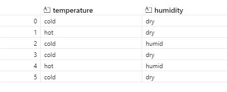

# experimental_design
Tools to create and manage design of experiments (DOE) or statistical design of experiments.

# Installation
## Method 1 - Directly from Github
```shell
pip install git+https://github.com/usnistgov/experimental_design
```
## Method 2 - Clone then Install
1. Use your favorite way to clone the repo or download the zip file and extract it.  
2. pip install to that location (note pip expects a unix style string 'C:/Users/sandersa/VSCode Repos/experimental_design/')
```shell
pip install <path to top folder>
```

# Use Case
When exploring an experimental space with one or more factors, it is useful to use an [experimental design](https://en.wikipedia.org/wiki/Design_of_experiments). A simple experimental design would be one in which you vary one or more factors, by setting them at one or more different levels, and measure a single response. For example, to see if temperature and/or humidity affect a particular current reading you could pick a hot, cold, dry and humid condition and then measure current. A systematic approach would be to use a [2x2 fully factorial design](https://en.wikipedia.org/wiki/Factorial_experiment), in which every combination of temperature and humidity are tried in some order [(hot,humid),(hot,dry),(cold,humid), (cold,dry)]. This package allows one to create this type of table for any number of factors with any number of settings. In addition, it provides the benefit of having repeatable randomization and adding in a default (or control) value for factors. The above example is created by
```python
import experimental_design 
import pandas as pd
design = {}
design["temperature"] = {"-":"cold","+":"hot"}
design["humidity"] = {"-":"dry","+":"humid"}
test_conditions = experimental_design.fully_factorial(design)
test_conditions_df = pd.DataFrame(test_conditions)
test_conditions_df
```
Now you can imagine that when you have 6000 factors with different number of levels this can be a daunting thing to do by hand. Additionally, randomizing the order, which is best practice, becomes quite cumbersome. And finally, making sure the experiment is working as planned, by going to a default, or control state, periodically adds even more complexity.
With this package making a design of 6,000 factors with a high and low state that are randomized and default values is just:
```python
import experimental_design 
import pandas as pd
n_factors = 6000
design = {f"F{i}":{"-":-1,"+":1} for i in range(1,n_factors+1)}
default = {f"F{i}":{0:"Default"} for i in range(1,n_factors+1)}
default_design = experimental_design.fully_factorial_default(design_dictionary=design,default_state=default,
                                                              randomized= True,random_seed= 42,run_values="values")
dd_df = pd.DataFrame(default_design)
dd_df
```
# Workflow
1. create a dictionary that has the factor names as keys and a dictionary of settings with names or level indicators as keys and specific test points as values 
```python
design = {"temperature":{"-":"cold","+":"hot"},"humidity":{"-":"dry","+":"humid"}}
```
2. Decide if you want or need a default (control test) and how frequently it would be tested
```python
default = {"temperature":{0:"cold"},"humidity":{0:"dry"}}  
```
3.  if you want a default use: 

```python
table = experimental_design.fully_factorial_default(design_dictionary=design, 
                                                    default_state = default, 
                                                    default_modulo=2,
                                                    randomized=True,
                                                    run_values="values",
                                                    random_seed =42)
```
and if you do not use:

```python 
table = experimental_design.fully_factorial(design_dictionary=design,
                                            randomized=True, 
                                            run_values="values",
                                            random_seed =42)
```
4. format and have fun! the resulting tables are lists of dictionaries, so if you want to use them as a [pandas](https://pandas.pydata.org/) dataframe it is just
```python
df = pd.DataFrame(table)
```


Currently, this repository has functionality for fully_factorial, fully_factorial_default, fully_factorial_split_plot, fully_factorial_split_plot_default and fully_factorial_split_plot_interleaved.

# Code Structure
This repository relies on [experimental_designs.py](./experimental_design/experimental_designs.py) for its functionality, for API style documentation see [documentation](https://pages.nist.gov/experimental_design).

# Example
An [example](./examples/experimental_designs_example.ipynb) of fully factorial designs with different factors and levels, with and without defaults. Additionally, the example demonstrates multiple whole plot / split plot designs with exclusions.  

# API Documentation
[API Documentation](https://pages.nist.gov/experimental_design) that lands at `__init__.py` and links to the primary submodule `experimental_designs.py`.  

# Contact
Aric Sanders [aric.sanders@nist.gov](mailto:aric.sanders@nist.gov)


# NIST Disclaimer
Certain commercial equipment, instruments, or materials (or suppliers, or software, ...) are identified in this repository to foster understanding. Such identification does not imply recommendation or endorsement by the National Institute of Standards and Technology, nor does it imply that the materials or equipment identified are necessarily the best available for the purpose.